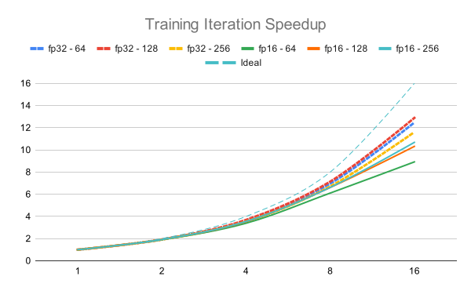
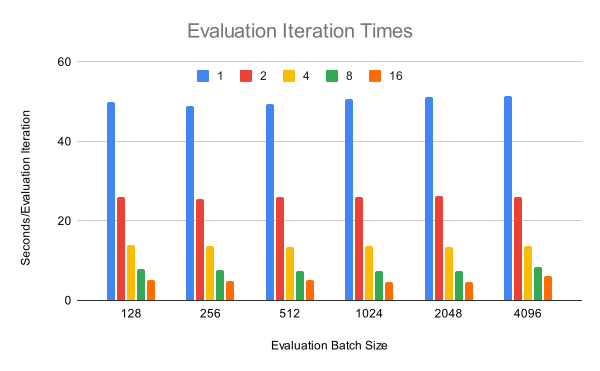

<h1 align="center">
<p>Training Transformers in Supercomputers with 🤗 Transformers, 🚀 Accelerate and Slurm
</h1>

- [Introduction](#introduction)
- [Experiments](#experiments)
  - [Training batch size](#training-batch-size)
  - [Mixed precision](#mixed-precision)
  - [Evaluation batch size](#evaluation-batch-size)
- [Modifications](#modifications)
  - [Distributed evaluation with a shared file system](#distributed-evaluation-with-a-shared-file-system)
  - [Broadcast the metric](#broadcast-the-metric)
- [Results](#results)
  - [Training Iteration](#training-iteration)
  - [Evaluation Iteration](#evaluation-iteration)
- [Conclusions](#conclusions)
- [Acknowledgements](#acknowledgements)

## Introduction
In this project, we have studied data parallelism to accelerate the training of transformers, both with multiple GPUs on the same node and across multiple nodes. We have primarily analyzed the effect of three variables: Training batch size, mixed precision and evaluation batch size.

All experiments were conducted using PyTorch, 🤗 Transformers for the models, 🤗 Datasets for preprocessing and injecting data into the model, 🤗 Evaluate for calculating model metrics, and 🤗 Accelerate for distributing the model training across multiple devices. We conducted the experiments on MareNostrum4 - CTE Power partition at the [Barcelona Supercomputing Center](https://www.bsc.es). This supercomputer utilized Slurm for job scheduling and resource management. The cluster is composed of 54 servers, each one containing:
- 2 x IBM Power9 8335-GTG @ 3.00GHz (20 cores and 4 threads/core, total 160 threads per node)
- 4 x GPU NVIDIA V100 (Volta) with 16GB HBM2.
- 512GB of main memory distributed in 16 dimms x 32GB @ 2666MHz
- 2 x SSD 1.9TB as local storage
- 2 x 3.2TB NVME
- Single Port Mellanox EDR
- GPFS via one fiber link 10 GBit

The environment in which we carried out the project is as follows:
```
CUDA Version: 10.2
Driver Version: 440.33.01
torch 1.13.0a0+git25e3331
transformers 4.24.0
accelerate 0.20.0
datasets 2.0.0
evaluate 0.4.1
```

In the execution of this project, we have primarily focused on the performance of the distributed training of the models, leaving precision or their learning capacity in the background. Nevertheless, we aimed to validate the theory by training a [DistilBERT](https://huggingface.co/distilbert-base-uncased) model on the [emotion](https://huggingface.co/datasets/dair-ai/emotion) dataset for a multi-class classification task. Below, we present the training configurations along with the results.

| Number of GPUs | Batch Size | Accuracy |  Time | Speedup |
|:--------------:|:----------:|:--------:|:-----:|:-------:|
|        1       |     256    |  0.9375  |  60.5 |    1    |
|        2       |     256    |   0.927  |  29.9 |  2.025  |
|        4       |     256    |   0.941  | 16.55 |  3.655  |
|        8       |     256    |    0.84  |  9.45 |   6.4   |
|       16       |     256    |    0.56  |  5.83 |   10.38 |
|        8       |     128    |    0.93  | 10.33 |   5.86  |
|       16       |     128    |    0.90  |  6.51 |   9.3   |

We conducted the experiments with an evaluation batch size of 256, a learning rate of 5e-4, and for 5 epochs. We only calculate the metric at the end of the training, and all experiments were conducted with fp16. For the cases of 8 and 16 devices, as the dataset is small, we could reduce the batch size to allow the model to update the parameters more frequently and converge to a better solution at the expense of slightly lengthening the training.

## Experiments
To conduct the study, we have relied on the traditional scheme of training a model over several epochs, in which, for each epoch, the model consumes the entire training dataset to update it's parameters and calculates a metric using the evaluation dataset. Therefore, both datasets are synthetic, and we will not consider the model metrics as our focus is on the training and communication performance. More specifically, we will focus on the throughput per GPU and how the time decreases in the training and evaluation phases as we increase the number of devices.

To do this, we will train a multi-class classification model with a dataset containing 32,768 training samples and 131,072 for evaluation. The metric we will calculate based on the model's predictions will be the accuracy.

Note that the evaluation part will be divided into three components: A first part in which the model makes predictions of the samples of the evaluation dataset on the GPU, the metric calculation from the predictions which will be computed by only one process (the _main_ or _master_ process) on the CPU, and the broadcast of the metric to the rest of the processes.
### Training batch size
The training batch size refers to the number of training samples utilized in one training step. During the training, the entire dataset is divided into smaller batches, and the model is updated based on the gradients calculated from each batch. In practical terms, the choice of the batch size is a hyperparameter that may require experimentation to find the optimal value for a specific task and dataset. 

In this study, we have considered batch sizes of 64, 128, and 256, as beyond 512 we encountered Out Of Memory (OOM) errors. Whenever we refer to batch size, we will be specifying the quantity per GPU involved. That is, in the case of 16 GPUs and a batch size of 256, we will have a global batch size of 4096 samples.
### Mixed precision
Another factor we have studied is the effect of mixed precision. We will work with fp32 and fp16, as, despite Accelerate offering the ability to work with bf16 and fp8, we cannot use them because V100 GPUs do not support them.
### Evaluation batch size
To make model predictions, we don't need to calculate gradients, so we will use the `torch.no_grad()` context manager, which will save us a significant amount of VRAM. This allows us to use larger evaluation batch sizes. We have studied evaluation batch sizes from 128, 256, 512, 1024, 2048 up to 4096, the maximum allowed by the GPU before incurring in OOM errors.

## Modifications
### Distributed evaluation with a shared file system
For computing the metrics, the 🤗 Hugging Face stack relies on a lock system to prevent conflicts. The implemented mechanism works correctly when operating in a local file system but is not designed for use in a shared file system, as is our case with GPFS. To address this issue, it is sufficient to make the following modifications to the source code of the 🤗 Datasets and 🤗 Evaluate libraries:
- Modify the `UnixFileLock` class in [`datasets/utils/filelock.py`](https://github.com/huggingface/datasets/blob/344086a7a1707ef20b57399f813ef64ce679e956/src/datasets/utils/filelock.py#L393), in order to use the `lockf` system call which works in shared file systems.

```diff
class UnixFileLock(BaseFileLock):
    """
    Uses the :func:`fcntl.flock` to hard lock the lock file on unix systems.
    """

    def __init__(self, lock_file, timeout=-1, max_filename_length=None):
        max_filename_length = os.statvfs(os.path.dirname(lock_file)).f_namemax
        super().__init__(lock_file, timeout=timeout, max_filename_length=max_filename_length)

    def _acquire(self):
        open_mode = os.O_RDWR | os.O_CREAT | os.O_TRUNC
        fd = os.open(self._lock_file, open_mode)

        try:
-           fcntl.flock(fd, fcntl.LOCK_EX | fcntl.LOCK_NB)
+           fcntl.lockf(fd, fcntl.LOCK_EX | fcntl.LOCK_NB)
        except OSError:
            os.close(fd)
        else:
            self._lock_file_fd = fd
        return None

    def _release(self):
        # Do not remove the lockfile:
        #
        #   https://github.com/benediktschmitt/py-filelock/issues/31
        #   https://stackoverflow.com/questions/17708885/flock-removing-locked-file-without-race-condition
        fd = self._lock_file_fd
        self._lock_file_fd = None
-       fcntl.flock(fd, fcntl.LOCK_UN)
+       fcntl.lockf(fd, fcntl.LOCK_UN)
        os.close(fd)
        return None
```
- Modify the `_check_all_processes_locks` method in [evaluate/module.py](https://github.com/huggingface/evaluate/blob/18932858570b9fa97ac478e1e6e709438e4d093b/src/evaluate/module.py#L340), to prevent the process 0 (which is the one that coordinates the rendezvous) from checking its own lock because it doesn't works with lockf.
```diff
def _check_all_processes_locks(self):
    expected_lock_file_names = [
        os.path.join(self.data_dir, f"{self.experiment_id}-{self.num_process}-{process_id}.arrow.lock")
        for process_id in range(self.num_process)
    ]
-   for expected_lock_file_name in expected_lock_file_names:
+   for expected_lock_file_name in expected_lock_file_names[1:]:
        nofilelock = FileFreeLock(expected_lock_file_name)
        try:
            nofilelock.acquire(timeout=self.timeout)
        except Timeout:
            raise ValueError(
                f"Expected to find locked file {expected_lock_file_name} from process {self.process_id} but it doesn't exist."
            ) from None
        else:
            nofilelock.release()
```

### Broadcast the metric
🤗 Evaluate only calculates the metrics on the main process. Therefore, if we want to use a callback based on this data, we will need to broadcast it to the rest of the processes. To do this, we simply have to create a tensor on all processes that we will move to the GPU where we will store the metric, and once calculated, broadcast it to the rest of the processes. 
```diff
+accuracy_tensor = torch.empty(1).cuda() # Tensor to allocate broadcasted accuracy 
for epoch in range(starting_epoch, num_epochs):
    ...
    ###################### Evaluation ######################
    model.eval()
    for step, batch in enumerate(eval_dataloader):
        with torch.no_grad():
            outputs = model(**batch)
        predictions = outputs.logits.argmax(dim=-1)
        predictions, references = accelerator.gather_for_metrics((predictions, batch["labels"]))
        metric.add_batch(
            predictions=predictions,
            references=references,
        )
    
    eval_metric = metric.compute()

    ###################### Broadcast #######################
+   if accelerator.is_main_process:
+       accuracy_tensor = torch.Tensor([eval_metric['accuracy']]).cuda()
    
+   broadcast(accuracy_tensor, 0)
```
## Results
In this section, we present and analyze the results of studying all the variables mentioned in the previous section, with a total of up to 4 nodes.
### Training Iteration
In the training iteration, the model consumes the entire dataset to update its parameters. This operation is the most costly and is composed of 4 phases:
1. **Forward Pass**: Each GPU performs a forward pass through the model using its local batch of data and calculates the loss.
2. **Backward Pass**: After the forward pass, each GPU computes the gradients of the loss with respect to the model parameters using backpropagation. This involves calculating how much each parameter contributed to the error.
3. **Gradient Aggregation**: The computed gradients from each GPU are then averaged, representing the overall direction in which the parameters should be updated to minimize the loss across all GPUs. This phase includes collective communications among all GPUs via NVLINK and NVSWITCH.
4. **Parameter Update**: Now that all GPUs have the same aggregated gradients, they will update the parameters, and each and every process will produce the same updated model.

Next, we present the results of experiments testing batch sizes of 64, 128, and 256, while enabling mixed precision.


In this graph, we display the throughput per device (measured in the number of samples the device can process per second) with different batch sizes and enabling mixed precision. Starting with experiments using fp32, we can observe that varying the batch size has virtually no influence on the throughput. This changes radically when working with fp16. At first glance, we notice that the throughput per device practically doubles, but the most striking aspect is that it also increases as we raise the batch size. This substantial improvement is attributed to tensor cores, a type of specialized hardware in the GPUs that accelerates matrix multiplications with reduced data types such as fp16. In general, we observe, for all six configurations, that as we increase the number of devices, the throughput decreases. This is due to the collective communications carried out to aggregate the gradients.


In this graph, we observe how what we have just discussed translates into a reduction in the time taken to consume the entire dataset. Next, we present the chart showing the speedup for each configuration compared to the case with 1 device. As we can see, the speedup up to the 8 GPU case (2 Nodes) is very close to the ideal, although when making the leap to 16 GPUs, we achieve a speedup of 10.7 for the batch size 256 - fp16 case. When working with multiple nodes, we must consider that the results may be influenced by the physical proximity of the nodes, the network topology, and even its utilization by other jobs from other users. Even though using fp32 may result in a better speedup, we will not consider it from now on, as we have clearly observed the improvements achieved by using fp16 in terms of throughput and completion times for the iteration.



### Evaluation Iteration
In the evaluation phase, the model generates predictions for the samples in the evaluation dataset, and subsequently, we calculate a metric which will be broadcasted to all the processes. We have computed the model's accuracy as the metric and employed fp16 in all experiments.


Unlike the training iteration, in the evaluation, we have observed that varying the evaluation batch size does not produce any changes in terms of throughput per device while performing the predictions. What we do observe is that as we increase the number of devices, it decreases. This is due to the way we aggregate all predictions from all devices to calculate the metric. On one hand, we perform a gather to collect all predictions, and subsequently, we write them to disk.



In this graph, we can observe that varying the evaluation batch size will not affect the time taken to generate predictions. Also, in the following graph, we can see a speedup similar to that achieved in the training iteration, remaining close to the ideal up to the case of 2 nodes and achieving a speedup of 11.1 for the case with an evaluation batch size of 2048.


Once the predictions are generated and stored, the metric will be computed by the _main_ process with the CPU. As we can see in the graph, the evaluation batch size does not affect the time to calculate it. What does have an effect is the number of devices, as the time to calculate the metric increases as this number goes up. This increase is particularly significant, as using 8 GPUs entails approximately 7.5 seconds for the predictions and 3 seconds for metric calculation. However, when transitioning to 16 devices, we manage to reduce the prediction generation time to 4.5 seconds while observing an increase in metric calculation time to 6 seconds, so we do not observe any benefit.


Finally, we have analyzed the time taken to broadcast the metric to the rest of the processes. As we could expect, as we increase the number of devices, the time to perform the broadcast also increases.

## Conclusions
- As for the training iteration, we have observed the significant performance improvement of using tensor cores with fp16. It's worth noting that implementing this change requires virtually no effort from the programmer, and we achieve a speedup of approximately 2. We have also seen how tensor cores benefit from using larger batch sizes. Finally, we have also observed that the more devices involved, the lower the throughput achieved. This is mainly due to communications between devices, and in our case, this issue is exacerbated by the absence of an NVSWITCH.
- As for the evaluation iteration, we have observed that varying the evaluation batch size has no impact on throughput, while increasing the number of devices involved does. We have seen that, due to the procedure it performs for metric calculation on the CPU, this increases considerably and may be a factor to take into account depending on the time spent generating predictions on the GPU. It is worth noting that this evaluation iteration does not have to be carried out every epoch, so the effects on the overall training would be diminished. Another option would be to perform the evaluation with only a portion of the devices involved in training, but this would be more complex to implement. Finally, regarding the broadcast of the metric, it is something that we will have to take into account if we significantly increase the number of devices.
## Acknowledgements
I have carried out this project under the supervision of Professor Jordi Torres from the Universitat Politècnica de Catalunya. I am deeply grateful for the assistance of Laia Julio, Ricard Zarco, and Felix Ramos from the BSC-Support team, who helped me prepare the environment for the project on MN4.